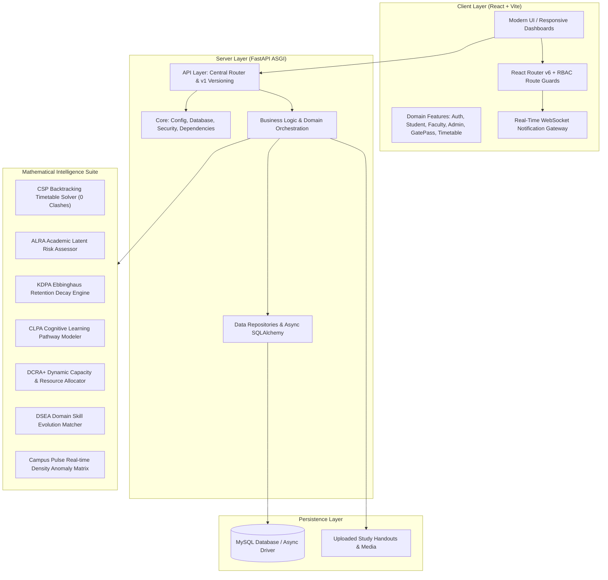

# Smart Campus AI Management System

> **An enterprise-grade, full-stack intelligent campus operations platform featuring automated CSP timetable scheduling, multi-tier digital gate pass lifecycle, real-time campus pulse density analytics, and personalized cognitive learning intelligence engines.**

[](https://fastapi.tiangolo.com)
[](https://reactjs.org)
[](https://vitejs.dev)
[](https://www.sqlalchemy.org)
[](https://www.mysql.com)
[-success.svg)](file:///d:/FInal%20Year/sci/backend/test_master_suite.py)

---

## 🏛️ System Architecture



---

## 🚀 Key Modules & Capabilities

| Module | Core Functionality | Primary Roles |
| :--- | :--- | :--- |
| **CSP Timetable Generator** | Constraint Satisfaction Backtracking algorithm producing zero faculty/room clash schedules. | Admin, HOD |
| **Multi-Tier Gate Pass** | AI exit-time recommendations, Warden approvals, signed QR cryptographic verification. | Student, Warden, Security |
| **Cognitive Intelligence (CLPA/KDPA)** | Multi-factor attention profiling & Ebbinghaus retention decay curves for spaced revision. | Student, Faculty |
| **Academic Risk Predictor (ALRA)** | Latent distress detection factoring attendance trajectories, backlogs, and internal marks. | Student, Faculty, HOD |
| **Campus Pulse Engine** | Real-time zone density matrix and 1-3 hour forward predictive activity forecasting. | Admin, Faculty |
| **Career Roadmap & DSEA** | ATS resume scoring, fuzzy Jaccard bigram skill gap analysis, and placement tracking. | Student, Admin |
| **Core Hub Management** | Institutional master data CRUD for departments, buildings, classrooms, and sections. | Admin |

---

## 📂 Production Repository Structure

```
project-root/
│
├── frontend/                          # React 18 + Vite Single Page Application
│   ├── src/
│   │   ├── app/                       # App.jsx, router guards, global providers
│   │   ├── features/                  # Domain modules: auth, student, faculty, admin, etc.
│   │   ├── components/                # Reusable UI primitives, charts, layouts, modals
│   │   ├── context/                   # AuthContext, NotificationContext, ThemeContext
│   │   ├── services/                  # Axios HTTP client, storage abstraction
│   │   └── styles/                    # Global CSS variables, themes, animations
│   ├── package.json
│   └── vite.config.js
│
├── backend/                           # FastAPI Asynchronous Application
│   ├── app/
│   │   ├── core/                      # Config, async database, security, dependencies
│   │   ├── api/                       # Central API router & v1 versioning
│   │   ├── models/                    # SQLAlchemy ORM entity models
│   │   ├── repositories/              # Database query repositories
│   │   ├── services/                  # Business logic services
│   │   ├── algorithms/                # ALRA, KDPA, CLPA, DCRA+, CSP, DSEA, ICQEA
│   │   ├── middleware/                # Rate limiter, input sanitizer, role checker
│   │   └── utils/                     # File upload, WebSocket notification manager
│   ├── tests/                         # Master 72-test validation suite & unit tests
│   └── requirements.txt
│
├── scripts/                           # Database seeding, migration, setup scripts
├── docs/                              # Architecture, algorithms, database, API specs
├── .env.example                       # Root environment configuration template
└── run_demo.bat                       # One-click dual-server launch script
```

---

## ⚡ Quick Start

### 1. Launch with One Command (Windows)
```cmd
run_demo.bat
```

### 2. Manual Server Execution
```powershell
# 1. Start FastAPI Backend (Port 8000)
cd "d:\FInal Year\sci\backend"
.\venv\Scripts\activate
$env:PYTHONUTF8="1"
uvicorn app.main:app --port 8000 --reload

# 2. Start Vite Frontend (Port 5174)
cd "d:\FInal Year\sci\frontend"
npm run dev
```

### 3. Run Automated Validation Test Suite
```powershell
cd "d:\FInal Year\sci\backend"
.\venv\Scripts\python.exe -u test_master_suite.py
```

---

## 👥 Pre-Configured Test Accounts

| Role | Email | Password | Primary Interface |
| :--- | :--- | :--- | :--- |
| **Student** | `student1@campus.com` | `password123` | Student Dashboard (`/dashboard`) |
| **Faculty** | `faculty1@campus.com` | `password123` | Faculty Portal (`/faculty`) |
| **Admin** | `admin@campus.com` | `password123` | Admin Core Hub (`/admin`) |
| **HOD** | `hod1@campus.com` | `password123` | Department Overview (`/hod`) |
| **Security** | `security1@campus.com` | `password123` | Gate Scanner (`/security/gate`) |
| **Guardian** | `guardian1@campus.com` | `password123` | Guardian Approvals (`/guardian/gate-pass`) |

---

## 📚 Technical Documentation

- [3D Campus Digital Twin Architecture](docs/THREE_JS_ARCHITECTURE.md)
- [System Architecture](docs/PROJECT_MASTER_DOCUMENTATION.md)
- [Algorithmic & Mathematical Formulations](complete_project_architecture_and_algorithms.md)
- [Database Schema & ER Model](docs/schema_details.md)
- [Test Cases & QA Validation Matrix](docs/TEST_CASES.md)

---

## 📜 License
Developed for Institutional Academic Management & Operations. All rights reserved.
