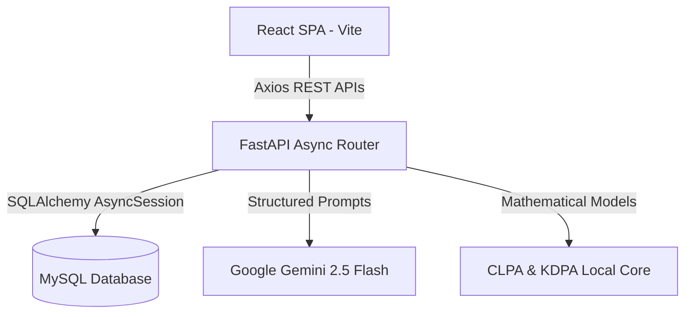

# Complete A-to-Z System Manual: Smart Campus AI Management System

This document serves as the comprehensive technical reference manual covering every feature, system architecture, database design, and algorithm deployed within the Smart Campus Management System.

---

## 1. System Architecture & Tech Stack



### Stack Components:
* **Frontend:** React 18, Vite, Tailwind CSS, Framer Motion, Lucide React icons.
* **Backend:** FastAPI (Python), Uvicorn ASGI Server, Pydantic (data validation).
* **Database Layer:** MySQL Relational DB, SQLAlchemy ORM (asyncio mode).
* **Caching & Utilities:** Local memory-based LRU Cache with Time-to-Live (TTL) control.

---

## 2. Core Modules & Platform Features

### 2.1 Student Portal
* **Academic Agenda:** Fetches the student's daily lecture timetable based on their department, year, and section. Stacked time blocks show ongoing vs. upcoming class schedules.
* **Attendance Tracker:** Displays overall and subject-wise attendance percentages, triggering caution warnings if attendance falls below the mandatory 75% threshold.
* **Coursework Submission:** Lists pending assignments, due dates, and grading marks.

### 2.2 Faculty Console
* **Mark Daily Attendance:** Interface to log student presence/absence per subject.
* **Coursework Publisher:** Interface to create assignments with target subjects and due dates.
* **Material Upload Portal:** Uploads study slides, PDFs, or lecture notes. The backend automatically categorizes materials using Gemini categorization.

### 2.3 Administrative Console
* **Global Insights Dashboard:** Displays total campus counts (active students, faculty, classrooms).
* **Classroom Utilization Matrix:** Shows hourly seat utilization rates across college rooms.
* **Announcements Board:** Publishes high-priority emergency alerts or general campus advisories.

---

## 3. Algorithm A: AI Learning Intelligence Engine

This engine consists of two proprietary algorithms working in tandem through a centralized **AI Decision Engine**.

### 3.1 Cognitive Learning Pattern Algorithm (CLPA)
Tracks student interactions to construct and evolve a dynamic learning style profile.

#### Mathematical Formulation (Rolling Reinforcement Rule)
For each cognitive dimension $d$ in the behavior vector $D$:
$$d_{t} = \alpha \cdot \text{Score}_{\text{event}} + (1 - \alpha) \cdot d_{t-1}$$
where $\alpha \approx 0.15$ is the rolling learning rate.

#### Behavioral Signal Inputs:
* **Reading event:** Computes reading efficiency:
  $$\text{Efficiency} = \min\left(\text{Scroll Depth \%} \times \frac{\text{Duration (seconds)}}{120}, 1.0\right)$$
* **Quiz event:** Ingests average scores normalized from 0.0 to 1.0.
* **Code event:** Success status (1.0 for success, 0.0 for compile errors).

#### Rolling Classifications:
* **Practical Learner:** High coding performance weights.
* **Reading Learner:** High reading efficiency weights.
* **Analytical Learner:** High quiz accuracy.
* **Consistent Learner:** High login/study consistency.

---

### 3.2 Knowledge Decay Prediction Algorithm (KDPA)
Predicts concept forgetting curves and models root prerequisite foundations.

#### Mathematical Forgetting Curve (Ebbinghaus Equation)
The active memory retention $R(t)$ at elapsed time $t$ (days since last study session) is:
$$R(t) = e^{-\frac{t}{S}}$$
Memory Strength $S$ is modeled as:
$$S = \gamma \cdot (1 + \text{revision\_count}) \cdot \left(1 + \frac{\text{mastery}}{100}\right) \cdot \frac{1}{D_f}$$
where:
* $\gamma$: Calibration factor (default $1.5$).
* $D_f$: Difficulty Factor ($1.0$ for Easy, $1.3$ for Medium, $1.8$ for Hard).

#### Prerequisite Propagation Graph
Let topic $B$ depend on prerequisite concept $A$. If the student's mastery in $A$ falls below 60%:
$$R_{\text{adjusted}}(B) = R(B) \times \left(0.7 + 0.3 \times \frac{\text{Mastery}(A)}{100}\right)$$

---

### 3.3 Central AI Decision Engine
Merges CLPA and KDPA to produce **Explainable AI (XAI)** recommendation cards:
1. Sorts topics by highest `revision_priority`.
2. Selects resource type based on `learning_style` (Practical Learners get coding exercises; Reading Learners get summaries).
3. Compiles user-facing rationales (e.g. *"Your retention for 'Binary Search' has decayed to 32% (High Decay Risk). Reviewing this will boost dependent topics."*).

---

## 4. Algorithm B: Fuzzy Skill-Gap Matcher

Analyzes technical resumes and target job profiles to calculate match percentages and missing skill checklists.

### 4.1 Character-Bigram Jaccard Similarity
To handle typos in user inputs (e.g. mapping `"Cloud Architecct"` to `"cloudarchitect"`):
$$J(S_1, S_2) = \frac{|G(S_1) \cap G(S_2)|}{|G(S_1) \cup G(S_2)|}$$
where $G(S)$ is the set of character bigrams in string $S$.

### 4.2 Concept Synonym Mapping
Maps developer tool names to standardized required skills (e.g. mapping `terraform` to `Infrastructure as Code`).

### 4.3 Set Intersection Analyzer
$$\text{Matched} = \text{Skills}_{\text{student}} \cap \text{Skills}_{\text{required}}$$
$$\text{Missing} = \text{Skills}_{\text{required}} - \text{Matched}$$
$$\text{Match Percentage} = \frac{|\text{Matched}|}{|\text{Skills}_{\text{required}}|} \times 100$$

---

## 5. Algorithm C: Interactive Study Planner & Watch Tracker

Compiles structured study schedules and suggestion links.

### 5.1 LLM Structured Study Roadmaps
Queries Gemini using Pydantic validation schemas to return structured JSON plans containing:
* Day numbers, focus titles, daily tasks list, study durations.
* Target `youtube_search_query` strings.

### 5.2 YouTube Watch Tracking
1. The student clicks a search query.
2. The system embeds educational YouTube videos in-app.
3. Spawns an active session watch timer, tracking total seconds studied.
4. Posts sessions to `/api/ai/study-session` to log student metrics.

---

## 6. System Schema & Database Mappings

```
==================================================================================
1. student_study_plans
   - id (INT, PK, Auto)
   - student_id (INT, FK -> users)
   - subject (VARCHAR(100))
   - topics (TEXT)
   - days (INT)
   - plan_json (TEXT)
   - is_active (BOOL)
   - created_at (DATETIME)
==================================================================================
2. study_sessions
   - id (INT, PK, Auto)
   - student_id (INT, FK -> users)
   - subject (VARCHAR(100))
   - topic (VARCHAR(200))
   - duration_seconds (INT)
   - created_at (DATETIME)
==================================================================================
3. student_cognitive_profiles
   - student_id (INT, PK, FK -> users)
   - reading_efficiency (FLOAT)
   - quiz_accuracy (FLOAT)
   - coding_performance (FLOAT)
   - focus_index (FLOAT)
   - learning_style (VARCHAR(50))
==================================================================================
4. student_topic_knowledge
   - id (INT, PK, Auto)
   - student_id (INT, FK -> users)
   - topic (VARCHAR(200))
   - mastery (FLOAT)
   - retention (FLOAT)
   - decay_risk (FLOAT)
   - last_revisited_at (DATETIME)
==================================================================================
```

---

## 7. Main REST API Router Guide

| Method | Endpoint | Description |
| :--- | :--- | :--- |
| **POST** | `/api/ai/study-plan` | Compiles a day-by-day study roadmap. |
| **GET** | `/api/ai/study-plans` | Returns generated plan history list. |
| **PUT** | `/api/ai/study-plans/{id}/activate` | Restores/resumes a roadmap. |
| **POST** | `/api/learning-intelligence/track` | Logs interaction signals for CLPA profiles. |
| **GET** | `/api/learning-intelligence/profile` | Fetches cognitive vectors, retention states & recommendations. |
| **GET** | `/api/learning-intelligence/faculty-analytics` | Renders heatmaps andflags high-decay students. |
