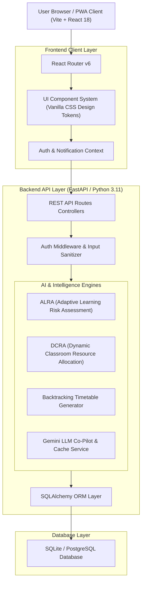
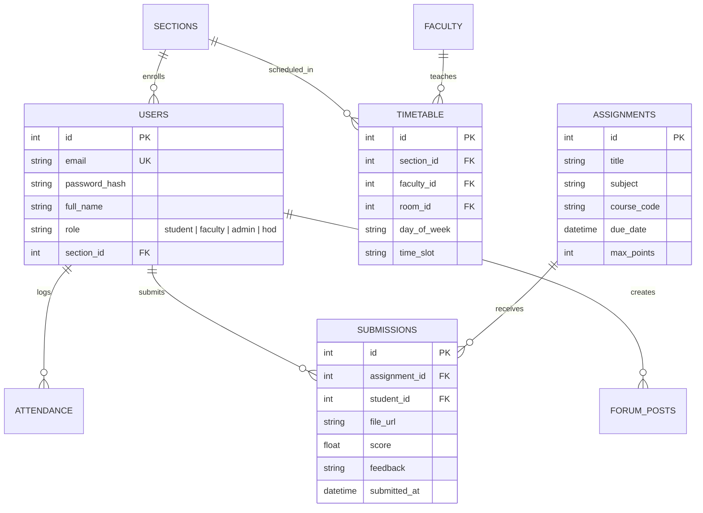

# SCME-AWN: Smart Campus Management & AI Learning Intelligence Ecosystem
## Master Technical Architecture & Specification Blueprint (A to Z)

---

## 1. Executive Summary & System Overview

**SCME-AWN (Smart Campus Ecosystem)** is an enterprise-grade, AI-powered college management and adaptive learning intelligence platform. Designed as a modern, decoupled web application, SCME-AWN bridges administrative workflows, academic resource allocation, and real-time student learning analytics into a unified digital environment.

### Primary Project Objectives:
- **Adaptive Student Analytics**: Real-time identification of academic risk using exponential decay and learning velocity models.
- **Automated Scheduling**: Constraint-Satisfaction Problem (CSP) timetable generation eliminating faculty, room, and section schedule overlaps.
- **Intelligent Campus Operations**: Automated attendance tracking, assignment evaluation workflows, placement eligibility matching, and live faculty location tracking.
- **Context-Aware AI Co-Pilot**: Multi-turn academic assistant integrated with Google Gemini API and local caching for rapid query resolution.

---

## 2. High-Level Architecture Diagram



---

## 3. Core AI Intelligence Algorithms & Mathematical Formulations

### A. ALRA (Adaptive Learning Risk Assessment Algorithm)
Calculates a student's risk profile ($\mathcal{R}$) by tracking score decay over time combined with assignment submission velocity.

$$\mathcal{S}_{decay} = \sum_{i=1}^{n} \Big( S_i \times e^{-\lambda (t_{current} - t_i)} \times \gamma_i \Big)$$

Where:
- $S_i$: Normalized score on assignment $i \in [0, 1]$
- $\lambda$: Half-life decay constant ($\lambda = 0.05$)
- $t_{current} - t_i$: Elapsed days since evaluation
- $\gamma_i$: Subject difficulty scaling factor ($\gamma_i \ge 1.0$)

The risk level is categorized as:
- **Low Risk ($\mathcal{R} < 0.25$)**: Student performs consistently above target thresholds.
- **Moderate Risk ($0.25 \le \mathcal{R} < 0.60$)**: Mild velocity drop; automated tutoring suggested.
- **Critical Academic Risk ($\mathcal{R} \ge 0.60$)**: Urgent faculty alert dispatched automatically.

### B. Backtracking Timetable Generator (CSP Solver)
The automated scheduler handles multi-variable constraints:
1. **Hard Constraints**:
   - No faculty can teach 2 sessions simultaneously.
   - No classroom can host 2 sections at the same hour.
   - Section student count $\le$ Classroom seat capacity.
2. **Soft Constraints**:
   - Uniform distribution of heavy subjects (e.g., Mathematics, Machine Learning) across morning slots.
   - Lab sessions allocated in continuous 2-hour slots.

---

## 4. Complete Database Schema (ERD & Table Directory)



### Table Reference Summary:
| Table Name | Description | Key Attributes |
| :--- | :--- | :--- |
| `users` | User credentials & roles | `id`, `email`, `role`, `department_id`, `section_id` |
| `sections` | Academic section batches | `id`, `name`, `department_id`, `year` |
| `subjects` | Course offerings | `id`, `code`, `name`, `credits`, `department_id` |
| `classrooms` | Physical room assets | `id`, `room_number`, `capacity`, `is_lab` |
| `assignments` | Coursework briefs | `id`, `title`, `due_date`, `subject`, `max_points` |
| `assignment_submissions` | Student submissions | `id`, `assignment_id`, `student_id`, `score`, `feedback` |
| `attendance` | Daily attendance logs | `id`, `student_id`, `subject_id`, `status`, `date` |
| `placements` | Recruitment drives | `id`, `company_name`, `min_cgpa`, `package_lpa`, `drive_date` |
| `forum_posts` | Peer learning threads | `id`, `author_id`, `title`, `content`, `likes_count` |

---

## 5. Backend REST API Endpoint Directory

### Authentication & User Core (`/api/auth`)
- `POST /api/auth/login`: Authenticates credentials, sets HTTP-only refresh cookie, returns JWT bearer token.
- `POST /api/auth/refresh`: Issues fresh access token using valid refresh token.
- `GET /api/auth/me`: Fetches profile details of current user.

### Academic Operations (`/api/assignments`, `/api/attendance`)
- `GET /api/assignments/`: Retrieves assignments filtered by current user role and section.
- `POST /api/assignments/{id}/submit`: Submits solution URL/archive for coursework.
- `POST /api/assignments/{id}/grade`: Faculty grading endpoint for scoring and feedback.
- `GET /api/attendance/summary`: Aggregates student attendance percentage across enrolled courses.

### Admin Core Hub & Automation (`/api/admin`, `/api/core-hub`)
- `POST /api/admin/timetable/generate`: Runs backtracking CSP scheduler to generate non-overlapping timetables.
- `POST /api/admin/data-import`: Batch imports faculty, student, and classroom CSV/Excel files.

### AI Assistant & Analytics (`/api/ai`)
- `POST /api/ai/chat`: Multi-turn Gemini API interaction for academic support and tutoring.
- `GET /api/ai/risk-analysis/{student_id}`: Evaluates ALRA score decay and risk status for target student.

---

## 6. Frontend Module & UI Directory

```
sci/frontend/src/
├── api/                  # Axios interceptors & JWT handling
├── components/
│   ├── Layout/           # Sidebar & Navbar container wrappers
│   ├── Sidebar/          # Dynamic role-based navigation sidebar
│   ├── Navbar/           # Top bar with notifications & user profile
│   └── ui/               # Core UI primitive design system
│       ├── Button/ Card/ Modal/ Badge/ DataTable/ StatCard/ Logo
├── context/
│   ├── AuthContext.jsx   # Authentication state & role routing
│   ├── ThemeContext.jsx  # Dark / Light mode design system tokens
│   └── NotificationContext.jsx
└── pages/
    ├── admin/            # Admin Dashboard, Timetable Generator, Core Hub
    ├── auth/             # Login, Register, Forgot Password
    ├── faculty/          # Faculty Dashboard, Attendance Grader, Locator
    ├── shared/           # LandingPage, AIAssistant, Events, Placements, Forum
    └── student/          # Student Dashboard, Assignments, Attendance, Results
```

---

## 7. Setup & Execution Guide

### Prerequisite Requirements:
- **Python**: 3.10 or higher
- **Node.js**: 18.0 or higher
- **Database**: SQLite (built-in) or PostgreSQL

### Step-by-Step Installation:

1. **Backend Setup**:
   ```bash
   cd sci/backend
   python -m venv venv
   # On Windows:
   .\venv\Scripts\activate
   pip install -r requirements.txt
   python seed_data.py
   uvicorn app.main:app --reload --port 8000
   ```

2. **Frontend Setup**:
   ```bash
   cd sci/frontend
   npm install
   npm run dev
   ```

3. **Production Build**:
   ```bash
   cd sci/frontend
   npm run build
   ```

---

## 8. Summary Matrix

- **Backend Framework**: FastAPI (Asynchronous Python REST API)
- **Frontend Framework**: React 18 + Vite + Framer Motion
- **Styling Architecture**: Vanilla CSS Design Tokens with HSL Tailored Dark Mode
- **Intelligence Algorithms**: ALRA, DSEA, ICQEA, DCRA, CSP Backtracking Scheduler
- **State Management**: React Context API + LocalStorage persistence
