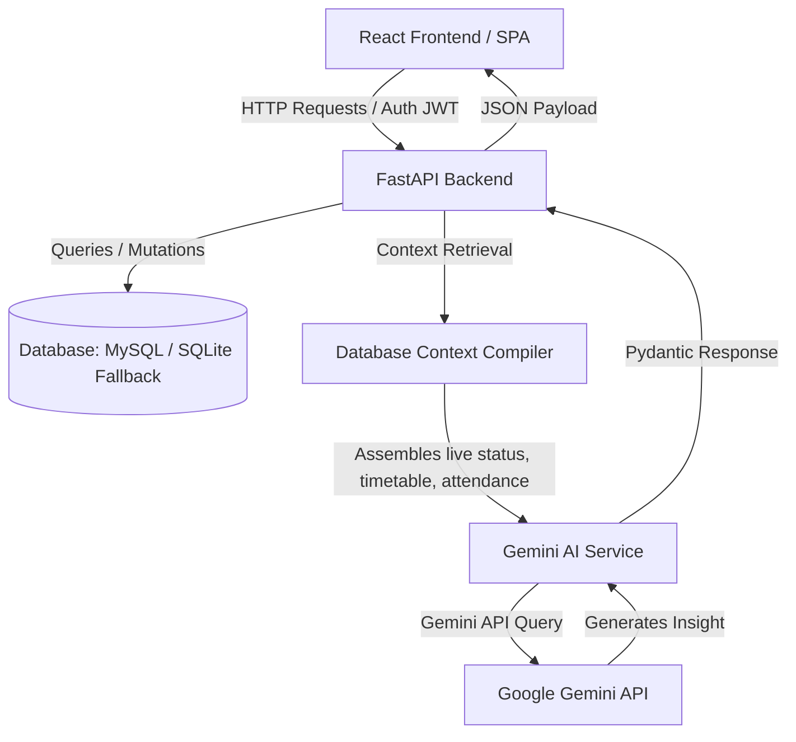
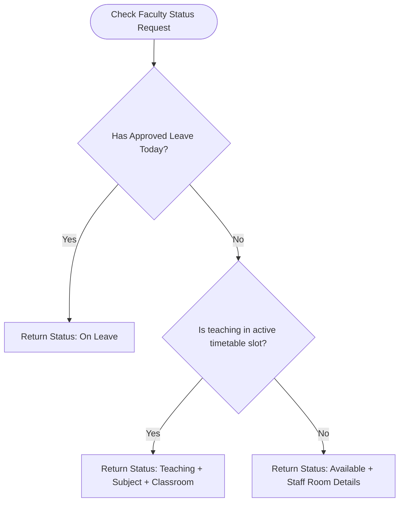

# 🎓 Smart Campus AI (SCI) — Comprehensive Project Architecture & Future Roadmap

Smart Campus AI (SCI) is a state-of-the-art, AI-powered intelligent college management ecosystem designed to bridge academic operations and advanced student assistance. This document details the architectural foundation, features, and database design of SCI, concluding with a comprehensive roadmap of future implementations ideal for a final-year thesis or project presentation.

---

## 🏗️ System Architecture & Tech Stack

The application follows a modern decoupled architecture, separating the responsive Single Page Application (SPA) frontend from the high-performance asynchronous API backend.

### 💻 Frontend Tech Stack
* **Framework**: React 18 + Vite (configured with custom path aliases `@/*` for clean modularity).
* **Language**: TypeScript (strict type checking for robustness).
* **Styling**: Tailwind CSS (extending design tokens inspired by premium SaaS platforms like Linear and Vercel).
* **Animations**: Framer Motion (delivering smooth page transitions, list re-ordering, and micro-interactions).
* **Data Visualization**: Recharts (dynamic, interactive attendance charts, marks analytics, and dashboard stats).

### ⚙️ Backend Tech Stack
* **Framework**: FastAPI (high-performance, asynchronous Python using `async/await` paradigms).
* **Database Access**: SQLAlchemy 2.0 ORM with `aiosqlite` for asynchronous driver operations.
* **Dual Database Fallback Engine**:
  * **MySQL**: Default production database.
  * **SQLite**: Automatically boots up locally via a fallback connection checker if no MySQL instance is active, ensuring zero-configuration local setups.
* **Authentication**: JWT (JSON Web Tokens) with secure client headers, password verification powered by Bcrypt hashing.
* **AI Core**: Google Generative AI SDK, binding database contexts to LLM prompts.

---

## 🌟 Key Functional Modules

### 1. 🤖 AI Assistant Hub (Gemini Integrations)
Unlike typical chatbots, the SCI Assistant compiles database snapshots (such as current timetable slots, assignments, attendance, announcements, and faculty status) and feeds them into the Gemini model. This allows context-aware inquiries like: *"Is Prof. Sarah teaching right now?"* or *"Summarize my upcoming assignments due this week."*

The Hub features five specialized sub-tools:
* **Academic Chat**: Contextual study buddy answering queries in markdown format.
* **Study Planner**: Auto-generates structured daily timetables based on specific topics, subjects, and study days.
* **Notes Summarizer**: Processes PDF text (extracted via `pdfplumber` or `pypdf` on the backend) and yields high-level summaries and potential quiz questions.
* **Interactive Quizzer**: Dynamically creates custom MCQs with selectable difficulty, evaluating student responses in real-time.
* **Placement Helper**: Performs skill-gap analysis, reviews mock resumes, generates mock interview questions, and provides career advice based on the student's department and CGPA.

### 2. 📍 Faculty Locator System
A smart routing engine that determines a faculty member's current availability dynamically. It checks multiple conditions in real-time:

* **On Leave**: Resolves by checking the `FacultyLeave` table for approved entries on the current date.
* **Teaching**: Intersects the master active timetable with the current system time, day of the week, and instructor name, resolving which classroom, year, and section the faculty is lecturing.
* **Available**: Defaults to available and displays their registered staff room and room hours.

### 3. 📊 Attendance & Academic Progress
* **Visual Gauges**: Circular progress indicators showing overall attendance percentage with color alerts (e.g., green for $\ge 75\%$, amber for $60\% - 74\%$, and red for $< 60\%$).
* **Grade Tracking**: Renders dynamic bar and line charts reflecting internal marks distribution and semester-by-semester GPA trends.

### 4. 💼 Placement & Careers Portal
* **Company Profiles**: Directory of companies visiting campus with logo, website, and location.
* **Job Board**: Displays active postings, eligibility criteria (minimum CGPA, allowed departments), deadlines, and CTC packages.
* **Application Tracker**: Allows students to upload resume paths and check status updates (*Applied*, *Shortlisted*, *Interviewing*, *Selected*, *Rejected*).

---

## 🗄️ Database Relationships Schema

The database relies on a structured, relational SQL schema. The following entity relationships highlight how users, department structures, and academic activities connect:

| Entity Name | Key Fields | Relationships |
| :--- | :--- | :--- |
| **User** | `id`, `email`, `password_hash`, `role`, `name`, `department`, `semester`, `staff_room` | Parent table for Students, Faculty, and Admins. Connects to Attendance, Submissions, and Leaves. |
| **Department** | `id`, `name`, `code` | Maps to academic subjects and timetable templates. |
| **TimetableEntry**| `id`, `timetable_id`, `day`, `start_time`, `end_time`, `subject`, `faculty`, `room` | Linked to parent **Timetable** specifying department, year, and section. Used for status checks. |
| **Attendance** | `id`, `student_id`, `subject`, `date`, `status` (*Present* / *Absent*) | Tracks daily records per student. |
| **Assignment** | `id`, `title`, `description`, `due_date`, `created_by` (Faculty ID) | Faculty creates assignments; students submit files. |
| **Submission** | `id`, `assignment_id`, `student_id`, `file_path`, `score`, `feedback` | Evaluated by faculty. |
| **FacultyLeave** | `id`, `faculty_id`, `leave_type`, `start_date`, `end_date`, `status` | Checked by Faculty Locator to confirm unavailability. |
| **Placement** | `id`, `company_name`, `job_role`, `ctc`, `cgpa_cutoff`, `deadline` | Linked to **PlacementApplication** which matches students to active postings. |

---

## 🔮 Future Implementations & Enhancements

For a final-year project, the system can be expanded with the following advanced modules:

### 1. 🔍 Semantic Resume Parser & Matcher
* **Concept**: Replace manual matching with an AI-driven vector search.
* **Implementation**:
  * Extract text from student resumes and run it through text embedding models (e.g., `text-embedding-ada-002` or HuggingFace transformers).
  * Store embeddings in a Vector Database (like **ChromaDB**, **Milvus**, or **pgvector**).
  * Convert job descriptions into vectors and perform cosine similarity queries to recommend the top matching candidates to placement officers, or recommend the best-fitting jobs to students.

### 2. 📍 Real-Time Faculty Geolocation (IoT / BLE)
* **Concept**: Transition the Faculty Locator from timetable scheduling to physical real-time positioning.
* **Implementation**:
  * Deploy BLE (Bluetooth Low Energy) beacons in classrooms, staff rooms, and laboratories.
  * Integrate the university's mobile app to scan beacons in the background and update the database with approximate room-level location coordinates.
  * Provide an interactive campus map (using Leaflet.js or Mapbox) showing live faculty pins when they are in public university zones.

### 3. 📸 Vision-Based Automated Answer Sheet Grading
* **Concept**: Accelerate the grading process for faculty members.
* **Implementation**:
  * Allow faculty to upload photos of handwritten student answer sheets via a mobile camera.
  * Use Gemini Vision API to extract handwritten text and compare it against a standard answer key.
  * Auto-suggest grades and draft rubrics-based feedback, which faculty can review and override before publishing.

### 4. 🖲️ Dynamic QR Attendance with Geofencing
* **Concept**: Prevent proxy attendance.
* **Implementation**:
  * The projector/smartboard in the classroom renders a dynamic QR code that refreshes every 10–15 seconds with a cryptographically signed timestamp.
  * Students scan the QR code via the portal.
  * The portal captures the student's current GPS coordinates (HTML5 Geolocation API) and validates that they are within a 15-meter radius of the classroom before logging attendance.

### 5. 📉 Predictive ML Analytics for Student Success
* **Concept**: Identify students at risk of academic failure or attendance shortage before it happens.
* **Implementation**:
  * Train an offline Scikit-Learn classification model (e.g., Random Forest or XGBoost) using historical student records (grades, assignment submission times, attendance rates, activity scores).
  * Build a backend microservice to run inference on current student profiles.
  * Display a "Risk Level" dashboard for faculty and admins, flagging students with high probabilities of failing or missing attendance targets.

### 🎙️ 6. Voice-Activated Campus Assistant
* **Concept**: Enhancing accessibility for visually impaired users.
* **Implementation**:
  * Integrate Web Speech API (Speech Recognition & Speech Synthesis) directly on the client side.
  * Allow users to say commands like *"When is my next exam?"* or *"Generate a quiz on React Hooks,"* and receive read-aloud spoken responses.
