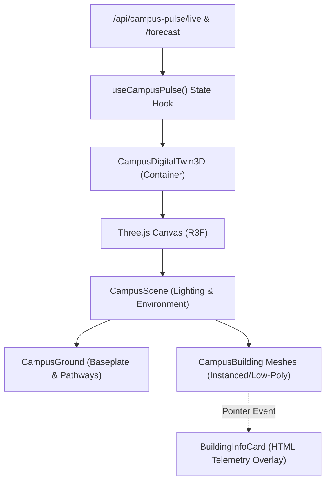

# Three.js & WebGL Campus Digital Twin Architecture

This document details the design, coordinate geometry, WebGL rendering pipeline, and real-time state synchronization powering the **3D Campus Digital Twin** embedded in **Campus Pulse**.

---

## 1. System Overview

The 3D Campus Digital Twin provides a real-time spatial visualization of university operations. It connects physical campus building coordinates with active telemetry from the backend (`GET /api/campus-pulse/live` and `GET /api/campus-pulse/forecast`).

---

## 2. Spatial Coordinate System

The 3D coordinates map directly to the backend coordinate geometry defined in [`sci/backend/app/algorithms/dcra_service.py`](file:///d:/FInal%20Year/sci/backend/app/algorithms/dcra_service.py#L13-L21) (`BUILDING_COORDS`):

| Building Entity | Backend Grid `(x, y)` | 3D World Vector `[X, Y, Z]` | Dimensions `[W, H, D]` | Department Affinity |
| :--- | :---: | :---: | :---: | :--- |
| **CS Block** | `(0, 0)` | `[-16, 0, -14]` | `[9.0, 7.5, 9.0]` | Computer Science & Engineering |
| **Admin Block**| `(1, 0)` | `[  0, 0, -14]` | `[11.0, 8.5, 8.0]` | Institutional Administration |
| **Science Block**| `(2, 0)` | `[ 16, 0, -14]` | `[8.5, 6.5, 8.5]` | Basic Sciences & Humanities |
| **ECE Block** | `(1, 1)` | `[  0, 0,   1]` | `[9.5, 7.0, 9.0]` | Electronics & Communication |
| **IT Block** | `(0, 2)` | `[-16, 0,  16]` | `[8.5, 7.0, 8.5]` | Information Technology |
| **ME Block** | `(2, 2)` | `[ 16, 0,  16]` | `[10.0, 6.0, 10.0]` | Mechanical & Robotics |

The coordinate layout preserves the Euclidean distance calculations used by the **DCRA+ (Dynamic Capacity & Resource Allocation)** engine for walking distance optimization.

---

## 3. Real-Time Crowd Density Mapping

Density metrics fetched from `/api/campus-pulse/live` drive the visual state of each building:

| Density Level | Pulse Color | Emissive Glow | Operational Status |
| :--- | :---: | :---: | :--- |
| **< 45%** | `#10b981` (Emerald) | `#059669` (Low) | **Optimal Flow**: Under-utilized or standard lecture capacity |
| **45% - 75%** | `#f59e0b` (Amber) | `#d97706` (Medium)| **Moderate Activity**: Typical peak session activity |
| **> 75%** | `#ef4444` (Rose) | `#dc2626` (High) | **Peak Density**: Anomaly alert or exam hall congestion |

Each building renders:
1. **Dynamic Ground Ring**: Emits an animated circular heatmap footprint reflecting current block occupancy.
2. **Emissive Material Intensity**: Scales dynamically based on current crowd density percentage.
3. **Floating 3D HTML Badge**: Shows the building name and live density percentage in world space via Drei's `<Html>` component.

---

## 4. User Interaction & Camera Controls

* **OrbitControls**:
  - Damping: `dampingFactor = 0.08` for smooth momentum.
  - Polar Angle: Clamped to `Math.PI / 2.15` to prevent the camera from clipping below the campus terrain plane.
  - Zoom Extents: `minDistance = 14`, `maxDistance = 72`.
* **Hover State**:
  - Elevates the building slightly on the Y-axis via spring interpolation (`lerp`).
  - Highlights building surface and presents instant preview in the HUD.
* **Selection State**:
  - Locks the target building in focus.
  - Opens the detailed telemetry overlay card displaying 1-3 hour predictive forecast, floor structure, and occupant counts.
* **Camera Toolbar**:
  - **Reset Button**: Restores standard 45° isometric perspective.
  - **Top-Down Button**: Aligns camera directly overhead (`position = [0, 48, 0.1]`) for schematic floorplan inspection.
  - **Fullscreen Expand**: Expands 3D viewport into immersive overlay mode.

---

## 5. WebGL Performance & Optimization

1. **Geometry Efficiency**: All buildings and terrain features utilize low-polygon box, cylinder, and ring geometries (< 2,500 total polygons across the entire scene).
2. **Device Pixel Ratio (DPR) Clamping**: `dpr={[1, 1.5]}` limits high-DPI overhead on 4K / Retina displays, ensuring stable 60 FPS performance on standard integrated GPUs.
3. **Shadow Optimization**: Directional shadow maps are restricted to 1024x1024 with a tight shadow bias (`-0.0001`) to eliminate shadow acne without CPU strain.
4. **Graceful 2D Degradation**: WebGL context creation is tested upon mount. If hardware acceleration is unavailable, the UI automatically transitions to the interactive 2D density matrix without crashing.
5. **Accessibility**: An off-screen HTML summary table (`.sr-only`) is generated alongside the canvas for screen readers, satisfying WCAG criteria.
