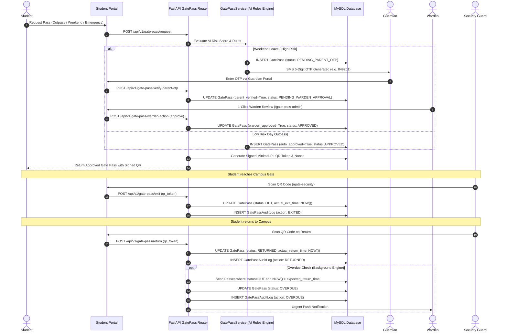
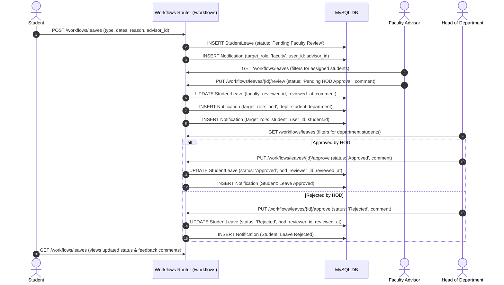
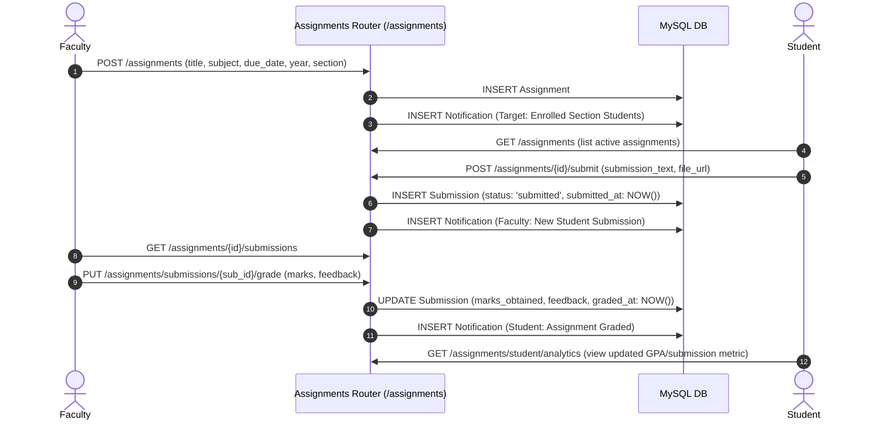
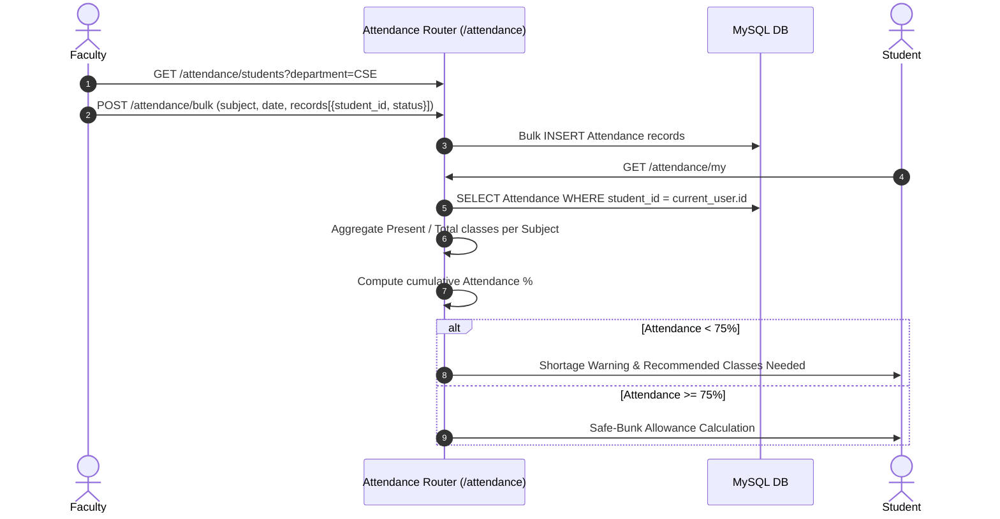
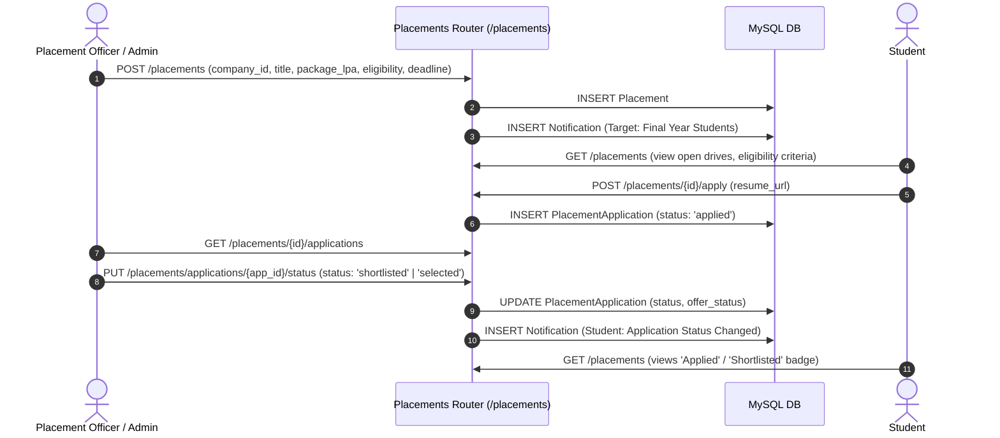

# Smart Campus AI — Workflow Dependency Graphs

This document details the multi-role handoffs, intermediate checkpoints, database side-effects, and notification pathways across all major business processes.

---

## 1. Autonomous Gate Pass & Perimeter Security Flow

---

## 2. Student Leave & On-Duty (OD) Multi-Tier Workflow

---

## 3. Assignment Lifecycle Workflow

---

## 4. Attendance Recording & Recalculation Flow

---

## 5. Placement Drive & Candidate Application Flow

