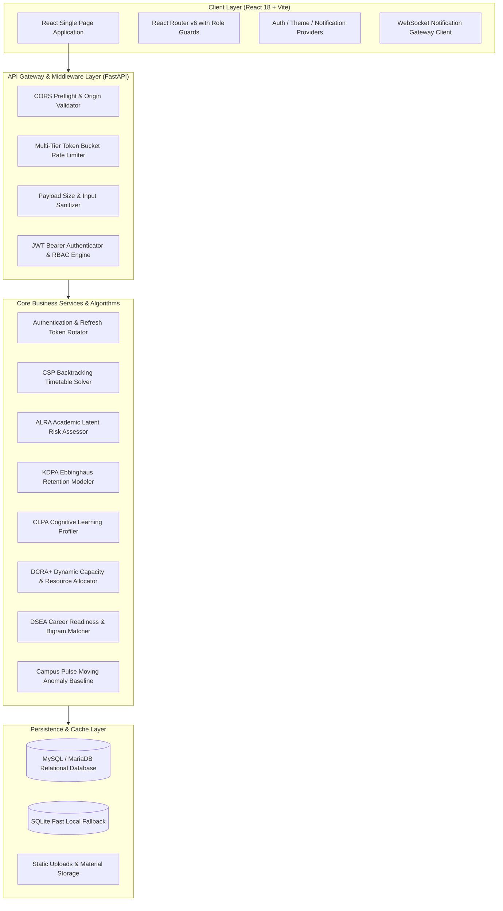

# Smart Campus AI — System Architecture & Design Specification

## 1. High-Level Architecture Overview

Smart Campus AI is an enterprise-grade academic management and cognitive intelligence platform engineered using a decoupled client-server architecture with asynchronous event handling and mathematical optimization engines.



---

## 2. Directory & Layer Organization

```
project-root/
│
├── frontend/                          # Client Application
│   ├── src/
│   │   ├── app/                       # Entry point, App.jsx, router, providers
│   │   ├── features/                  # Domain-driven feature packages
│   │   │   ├── auth/                  # Login, registration, password lifecycle
│   │   │   ├── student/               # Student portals, workflows, marks, results
│   │   │   ├── faculty/               # Faculty dashboard, locator, leaves
│   │   │   ├── admin/                 # Admin operations, core hub, data import
│   │   │   ├── attendance/            # Attendance records and daily section marking
│   │   │   ├── assignments/           # Coursework, attachment submissions, evaluations
│   │   │   ├── timetable/             # Schedules and CSP automated timetable generator
│   │   │   ├── gate-pass/             # Multi-tier digital outpass & QR verification
│   │   │   ├── learning-intelligence/ # CLPA cognitive radar & KDPA retention curves
│   │   │   ├── placements/            # Placement drives, resume reviewer, stats
│   │   │   ├── campus-pulse/          # Real-time campus density & predictive matrix
│   │   │   ├── forum/                 # Academic community discussions & replies
│   │   │   ├── events/                # Campus events & registrations
│   │   │   └── study-materials/       # Course material catalog & AI categorization
│   │   ├── components/                # Reusable UI primitives (UI, charts, layout, feedback)
│   │   ├── context/                   # React context providers
│   │   ├── services/                  # Axios HTTP client and storage services
│   │   └── styles/                    # Global CSS variables, animations, themes
│
├── backend/                           # Server Application
│   ├── app/
│   │   ├── core/                      # Config, database engine, security, dependencies
│   │   ├── api/                       # Central API router & v1 versioning
│   │   ├── models/                    # SQLAlchemy ORM entity models
│   │   ├── repositories/              # Persistence layer & DB queries
│   │   ├── services/                  # Business logic and domain orchestration
│   │   ├── algorithms/                # ALRA, KDPA, CLPA, DCRA+, CSP, DSEA, ICQEA
│   │   ├── middleware/                # Rate limiter, input sanitizer, role checker
│   │   └── utils/                     # File upload, WebSocket notification manager
│   ├── tests/                         # Unit, integration, and algorithm test suites
│
├── scripts/                           # Database seeding, schema creation, dev scripts
├── docs/                              # Architecture, algorithms, database, API specs
├── .env.example                       # Root environment variables template
└── README.md                          # Production project documentation
```

---

## 3. Security & RBAC Enforcement

- **JWT Authentication**: Short-lived access tokens (24h default) coupled with cryptographic token rotation stored in HTTP-only cookies.
- **Role Enforcement**: Strict decorator and dependency level checks (`Depends(require_role("admin", "hod"))`) guarding administrative, academic, and student operational boundaries.
- **Input Sanitization**: Content-type enforcement, request body byte limits, and anti-tampering guards on all form and JSON payloads.
