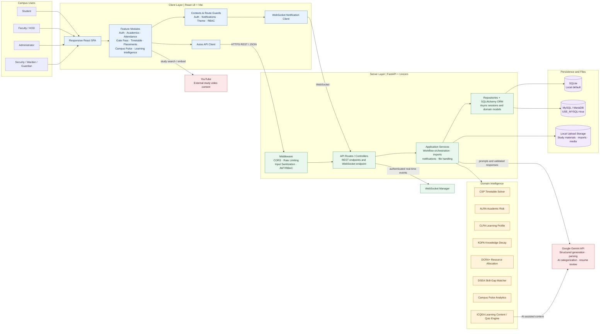

# Smart Campus AI Architecture

This diagram shows the deployed runtime architecture of the Smart Campus AI Management System. It reflects the implementation under `sci/frontend` and `sci/backend`.

## Runtime Flow

1. A campus user interacts with the React SPA through a role-specific feature module.
2. Axios sends authenticated REST requests to the FastAPI middleware and route layer.
3. Middleware validates origins, request size, rate limits, JWT claims, and role permissions before dispatch.
4. Application services coordinate repositories, uploads, notifications, and the intelligence algorithms.
5. SQLAlchemy persists data in SQLite by default on local Windows development, or MySQL/MariaDB when `USE_MYSQL=true`.
6. WebSocket notifications are pushed through the backend WebSocket manager to connected clients.
7. Gemini is used only for AI-assisted operations such as structured study plans, document/timetable parsing, categorization, quizzes, and resume review.

## Main Architectural Decisions

- **Client-server separation:** the React client contains presentation and interaction flows; domain decisions remain in FastAPI services and algorithms.
- **Repository boundary:** database access is isolated behind SQLAlchemy repositories, allowing SQLite and MySQL configuration without changing feature flows.
- **Algorithm isolation:** scheduling, risk, learning, allocation, placement, and campus analytics engines are kept separate from transport concerns.
- **Dual communication modes:** REST handles request/response workflows, while WebSockets handle live notifications and operational updates.
- **Local file boundary:** uploaded materials and imports are stored outside relational tables and referenced by backend services.