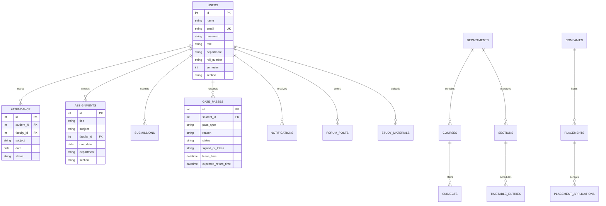

# Smart Campus AI — Database Architecture & Schema Specification

## 1. Database Architecture Overview

The persistence layer uses **SQLAlchemy Async ORM** connecting to **MySQL / MariaDB** (with SQLite async fallback for local zero-dependency testing).

### Core Database Configuration
- **Connection Pool**: 20 persistent connections with automatic reconnection and keep-alive recycling.
- **Async Driver**: `aiomysql` for non-blocking I/O operations.
- **Transactions**: Explicit async session commits with automatic rollback on unhandled exceptions.

---

## 2. Core Entity Relational Model

---

## 3. Entity Schema Breakdown

### 1. Identity & Core Access
- **`users`**: Central authentication table storing student, faculty, HOD, admin, security, and guardian credentials, department codes, semester, section, and first-login state flags.
- **`refresh_tokens`**: Stores cryptographic hashed refresh tokens with device IDs, rotation tracking, and expiration timestamps.

### 2. Academics & Scheduling
- **`departments`**: Academic units, HOD associations, building blocks, semester counts.
- **`courses` & `subjects`**: Degree curriculum, subject credits, weekly required lecture/lab hours.
- **`sections` & `classrooms`**: Physical facilities, capacity metrics, projector/smartboard amenities.
- **`timetables` & `timetable_entries`**: Generated weekly schedules with zero-clash constraints.

### 3. Gate Pass Lifecycle & Security
- **`gate_passes`**: Outpass, day pass, and emergency leaves with multi-tier approval states, AI exit recommendation time, and cryptographically signed QR tokens.
- **`gate_pass_policies`**: Institutional thresholds (minimum attendance %, maximum hours, curfew penalties).
- **`gate_pass_audit_logs`**: Immutable security ledger recording all warden actions, gate exit timestamps, and return scans.

### 4. Learning Intelligence & Cognition
- **`student_cognitive_profiles`**: CLPA attention, velocity, focus index, and learning style metrics.
- **`student_topic_knowledge`**: KDPA Ebbinghaus retention decay tracking, revision count, and mastery scores.
- **`student_career_roadmaps`**: DSEA industry readiness scores, skill gaps, and curated learning roadmaps.
