# Smart Campus AI Database Schema & Relationships

This document outlines the database structure of the Smart Campus AI platform. It contains the **Entity Relationship Diagram (ERD)** mapping core relationships, followed by a detailed table-by-table list of columns, data types, and foreign key constraints.

## 1. High-Level Entity Relationship Diagram (ERD)

```mermaid
erDiagram
    users ||--o{ refresh_tokens : has
    users ||--o{ faculty_leaves : requests
    users ||--o{ student_leaves : requests
    users ||--o{ student_ods : requests
    users ||--o{ timetables : views
    users ||--o{ announcements : posts
    users ||--o{ attendance : has
    users ||--o{ assignments : assigns
    users ||--o{ submissions : submits
    users ||--o{ event_registrations : registers
    users ||--o{ study_materials : uploads
    users ||--o{ internal_marks : receives
    users ||--o{ semester_results : receives
    users ||--o{ study_sessions : performs
    users ||--o{ student_study_plans : has
    users ||--o{ placement_applications : submits
    users ||--o{ notifications : receives
    users ||--o{ chat_history : generates
    users ||--o{ user_preferences : has
    users ||--o{ forum_posts : writes
    users ||--o{ forum_replies : writes
    
    users ||--o{ student_learning_interactions : generates
    users ||--o{ student_cognitive_profiles : has
    users ||--o{ student_topic_knowledge : has
    users ||--o{ student_learning_profiles : has
    users ||--o{ student_skill_profiles : has
    users ||--o{ student_career_roadmaps : has
    
    departments ||--|{ courses : contains
    courses ||--|{ subjects : has
    subjects ||--o{ timetable_entries : references
    classrooms ||--o{ timetable_entries : hosts
    timetables ||--|{ timetable_entries : contains
    
    assignments ||--|{ submissions : receives
    events ||--|{ event_registrations : has
    companies ||--|{ placements : offers
    placements ||--|{ placement_applications : has
    
    uploaded_documents ||--|{ document_chunks : parsed_into
    quizzes ||--|{ quiz_questions : has
    quizzes ||--|{ quiz_attempts : receives
    users ||--o{ quizzes : takes
```

## 2. Table Modules Overview
The tables are broadly categorized into the following modules:
1. **Core Identity & Administration**: `users`, `refresh_tokens`, `user_preferences`, `import_history`, `announcements`, `notifications`, `notification_reads`, `chat_history`.
2. **Academic & Timetable**: `departments`, `courses`, `subjects`, `classrooms`, `sections`, `buildings`, `academic_years`, `semesters`, `timetables`, `timetable_entries`, `timetable_versions`, `reallocation_logs`, `classroom_allocations`.
3. **Faculty & Student Life**: `faculty_leaves`, `student_leaves`, `student_ods`, `attendance`, `assignments`, `submissions`, `study_materials`, `events`, `event_registrations`, `faculty_workloads`.
4. **Placement**: `companies`, `placements`, `placement_applications`.
5. **AI Learning Engine & Analytics**: `student_learning_interactions`, `student_cognitive_profiles`, `student_topic_knowledge`, `student_learning_profiles`, `student_skill_profiles`, `student_career_roadmaps`, `uploaded_documents`, `document_chunks`, `quizzes`, `quiz_questions`, `quiz_attempts`, `quiz_analytics`, `behaviour_history`, `ai_insights`.

---

# DATABASE SCHEMA DETAILS

## Table: `users`
### Columns:
| Column | Type | PK | Nullable | FK / Details |
| --- | --- | --- | --- | --- |
| `id` | INTEGER | Yes | No |  |
| `name` | VARCHAR(100) | No | No |  |
| `email` | VARCHAR(100) | No | No |  |
| `password` | VARCHAR(255) | No | No |  |
| `role` | VARCHAR(7) | No | No |  |
| `department` | VARCHAR(100) | No | Yes |  |
| `roll_number` | VARCHAR(20) | No | Yes |  |
| `employee_id` | VARCHAR(50) | No | Yes |  |
| `staff_room` | VARCHAR(100) | No | Yes |  |
| `custom_status` | VARCHAR(50) | No | Yes |  |
| `semester` | INTEGER | No | Yes |  |
| `section` | VARCHAR(10) | No | Yes |  |
| `phone_number` | VARCHAR(20) | No | Yes |  |
| `is_first_login` | BOOLEAN | No | No |  |
| `password_changed` | BOOLEAN | No | No |  |
| `advisor_id` | INTEGER | No | Yes | FK -> `users.id` |
| `max_workload` | INTEGER | No | No |  |
| `preferred_availability` | TEXT | No | No |  |
| `created_at` | DATETIME | No | Yes |  |

## Table: `faculty_leaves`
### Columns:
| Column | Type | PK | Nullable | FK / Details |
| --- | --- | --- | --- | --- |
| `id` | INTEGER | Yes | No |  |
| `faculty_id` | INTEGER | No | No | FK -> `users.id` |
| `leave_type` | VARCHAR(100) | No | No |  |
| `start_date` | DATE | No | No |  |
| `end_date` | DATE | No | No |  |
| `status` | VARCHAR(20) | No | No |  |
| `reason` | TEXT | No | Yes |  |
| `supporting_document` | VARCHAR(500) | No | Yes |  |
| `created_at` | DATETIME | No | Yes |  |

## Table: `student_leaves`
### Columns:
| Column | Type | PK | Nullable | FK / Details |
| --- | --- | --- | --- | --- |
| `id` | INTEGER | Yes | No |  |
| `student_id` | INTEGER | No | No | FK -> `users.id` |
| `advisor_id` | INTEGER | No | Yes | FK -> `users.id` |
| `leave_type` | VARCHAR(100) | No | No |  |
| `start_date` | DATE | No | No |  |
| `end_date` | DATE | No | No |  |
| `reason` | TEXT | No | No |  |
| `supporting_document` | VARCHAR(500) | No | Yes |  |
| `status` | VARCHAR(50) | No | No |  |
| `faculty_reviewer_id` | INTEGER | No | Yes | FK -> `users.id` |
| `faculty_comment` | TEXT | No | Yes |  |
| `faculty_reviewed_at` | DATETIME | No | Yes |  |
| `hod_reviewer_id` | INTEGER | No | Yes | FK -> `users.id` |
| `hod_comment` | TEXT | No | Yes |  |
| `hod_reviewed_at` | DATETIME | No | Yes |  |
| `created_at` | DATETIME | No | Yes |  |

## Table: `student_ods`
### Columns:
| Column | Type | PK | Nullable | FK / Details |
| --- | --- | --- | --- | --- |
| `id` | INTEGER | Yes | No |  |
| `student_id` | INTEGER | No | No | FK -> `users.id` |
| `advisor_id` | INTEGER | No | Yes | FK -> `users.id` |
| `event_title` | VARCHAR(200) | No | No |  |
| `start_date` | DATE | No | No |  |
| `end_date` | DATE | No | No |  |
| `reason` | TEXT | No | No |  |
| `description` | TEXT | No | Yes |  |
| `supporting_document` | VARCHAR(500) | No | Yes |  |
| `status` | VARCHAR(50) | No | No |  |
| `faculty_reviewer_id` | INTEGER | No | Yes | FK -> `users.id` |
| `faculty_comment` | TEXT | No | Yes |  |
| `faculty_reviewed_at` | DATETIME | No | Yes |  |
| `hod_reviewer_id` | INTEGER | No | Yes | FK -> `users.id` |
| `hod_comment` | TEXT | No | Yes |  |
| `hod_reviewed_at` | DATETIME | No | Yes |  |
| `created_at` | DATETIME | No | Yes |  |

## Table: `timetables`
### Columns:
| Column | Type | PK | Nullable | FK / Details |
| --- | --- | --- | --- | --- |
| `id` | INTEGER | Yes | No |  |
| `department` | VARCHAR(100) | No | No |  |
| `year` | VARCHAR(20) | No | No |  |
| `section` | VARCHAR(10) | No | No |  |
| `created_at` | DATETIME | No | Yes |  |
| `is_active` | BOOLEAN | No | No |  |

## Table: `timetable_entries`
### Columns:
| Column | Type | PK | Nullable | FK / Details |
| --- | --- | --- | --- | --- |
| `id` | INTEGER | Yes | No |  |
| `timetable_id` | INTEGER | No | Yes | FK -> `timetables.id` |
| `subject` | VARCHAR(100) | No | No |  |
| `faculty` | VARCHAR(100) | No | Yes |  |
| `room` | VARCHAR(50) | No | Yes |  |
| `day` | VARCHAR(20) | No | No |  |
| `start_time` | TIME | No | No |  |
| `end_time` | TIME | No | No |  |
| `faculty_id` | INTEGER | No | Yes | FK -> `users.id` |
| `subject_id` | INTEGER | No | Yes | FK -> `subjects.id` |
| `department_id` | INTEGER | No | Yes | FK -> `departments.id` |
| `semester` | INTEGER | No | Yes |  |
| `section` | VARCHAR(10) | No | Yes |  |
| `period` | INTEGER | No | Yes |  |
| `classroom_id` | INTEGER | No | Yes | FK -> `classrooms.id` |

## Table: `timetable_versions`
### Columns:
| Column | Type | PK | Nullable | FK / Details |
| --- | --- | --- | --- | --- |
| `id` | INTEGER | Yes | No |  |
| `timetable_id` | INTEGER | No | Yes | FK -> `timetables.id` |
| `version` | INTEGER | No | No |  |
| `file_url` | VARCHAR(255) | No | Yes |  |
| `parsed_data` | TEXT | No | Yes |  |
| `uploaded_by` | INTEGER | No | Yes | FK -> `users.id` |
| `uploaded_at` | DATETIME | No | Yes |  |

## Table: `import_history`
### Columns:
| Column | Type | PK | Nullable | FK / Details |
| --- | --- | --- | --- | --- |
| `id` | INTEGER | Yes | No |  |
| `filename` | VARCHAR(255) | No | No |  |
| `total_records` | INTEGER | No | No |  |
| `successful_imports` | INTEGER | No | No |  |
| `failed_imports` | INTEGER | No | No |  |
| `uploaded_by` | INTEGER | No | Yes | FK -> `users.id` |
| `import_type` | VARCHAR(100) | No | Yes |  |
| `failed_records_log` | TEXT | No | Yes |  |
| `processing_time_ms` | INTEGER | No | Yes |  |
| `status` | VARCHAR(50) | No | Yes |  |
| `created_at` | DATETIME | No | Yes |  |

## Table: `announcements`
### Columns:
| Column | Type | PK | Nullable | FK / Details |
| --- | --- | --- | --- | --- |
| `id` | INTEGER | Yes | No |  |
| `title` | VARCHAR(200) | No | No |  |
| `content` | TEXT | No | No |  |
| `created_by` | INTEGER | No | Yes | FK -> `users.id` |
| `target_role` | VARCHAR(50) | No | No |  |
| `target_dept` | VARCHAR(50) | No | No |  |
| `is_emergency` | BOOLEAN | No | No |  |
| `created_at` | DATETIME | No | Yes |  |

## Table: `attendance`
### Columns:
| Column | Type | PK | Nullable | FK / Details |
| --- | --- | --- | --- | --- |
| `id` | INTEGER | Yes | No |  |
| `student_id` | INTEGER | No | Yes | FK -> `users.id` |
| `faculty_id` | INTEGER | No | Yes | FK -> `users.id` |
| `subject` | VARCHAR(100) | No | No |  |
| `date` | DATE | No | No |  |
| `status` | VARCHAR(7) | No | No |  |
| `status_type` | VARCHAR(50) | No | Yes |  |
| `edited_by` | INTEGER | No | Yes | FK -> `users.id` |
| `remarks` | VARCHAR(255) | No | Yes |  |

## Table: `assignments`
### Columns:
| Column | Type | PK | Nullable | FK / Details |
| --- | --- | --- | --- | --- |
| `id` | INTEGER | Yes | No |  |
| `title` | VARCHAR(200) | No | No |  |
| `description` | TEXT | No | Yes |  |
| `subject` | VARCHAR(100) | No | No |  |
| `faculty_id` | INTEGER | No | Yes | FK -> `users.id` |
| `due_date` | DATE | No | No |  |
| `department` | VARCHAR(50) | No | Yes |  |
| `year` | VARCHAR(20) | No | Yes |  |
| `class_name` | VARCHAR(50) | No | Yes |  |
| `section` | VARCHAR(10) | No | Yes |  |
| `attachments` | VARCHAR(500) | No | Yes |  |
| `created_at` | DATETIME | No | Yes |  |

## Table: `submissions`
### Columns:
| Column | Type | PK | Nullable | FK / Details |
| --- | --- | --- | --- | --- |
| `id` | INTEGER | Yes | No |  |
| `assignment_id` | INTEGER | No | Yes | FK -> `assignments.id` |
| `student_id` | INTEGER | No | Yes | FK -> `users.id` |
| `submitted_at` | DATETIME | No | Yes |  |
| `status` | VARCHAR(50) | No | Yes |  |
| `grade` | VARCHAR(20) | No | Yes |  |
| `remarks` | TEXT | No | Yes |  |
| `file_url` | VARCHAR(500) | No | Yes |  |
| `github_link` | VARCHAR(500) | No | Yes |  |
| `drive_link` | VARCHAR(500) | No | Yes |  |

## Table: `events`
### Columns:
| Column | Type | PK | Nullable | FK / Details |
| --- | --- | --- | --- | --- |
| `id` | INTEGER | Yes | No |  |
| `title` | VARCHAR(200) | No | No |  |
| `description` | TEXT | No | Yes |  |
| `event_date` | DATE | No | No |  |
| `venue` | VARCHAR(200) | No | Yes |  |
| `type` | VARCHAR(50) | No | Yes |  |
| `created_by` | INTEGER | No | Yes | FK -> `users.id` |
| `created_at` | DATETIME | No | Yes |  |

## Table: `event_registrations`
### Columns:
| Column | Type | PK | Nullable | FK / Details |
| --- | --- | --- | --- | --- |
| `id` | INTEGER | Yes | No |  |
| `event_id` | INTEGER | No | Yes | FK -> `events.id` |
| `student_id` | INTEGER | No | Yes | FK -> `users.id` |
| `registered_at` | DATETIME | No | Yes |  |

## Table: `departments`
### Columns:
| Column | Type | PK | Nullable | FK / Details |
| --- | --- | --- | --- | --- |
| `id` | INTEGER | Yes | No |  |
| `name` | VARCHAR(200) | No | No |  |
| `code` | VARCHAR(20) | No | No |  |
| `description` | TEXT | No | Yes |  |
| `hod_name` | VARCHAR(100) | No | Yes |  |
| `department_block` | VARCHAR(100) | No | Yes |  |
| `total_semesters` | INTEGER | No | Yes |  |
| `active` | INTEGER | No | Yes |  |
| `created_at` | DATETIME | No | Yes |  |

## Table: `courses`
### Columns:
| Column | Type | PK | Nullable | FK / Details |
| --- | --- | --- | --- | --- |
| `id` | INTEGER | Yes | No |  |
| `name` | VARCHAR(200) | No | No |  |
| `code` | VARCHAR(20) | No | No |  |
| `department_id` | INTEGER | No | No | FK -> `departments.id` |
| `semester` | INTEGER | No | No |  |
| `credits` | INTEGER | No | No |  |
| `created_at` | DATETIME | No | Yes |  |

## Table: `subjects`
### Columns:
| Column | Type | PK | Nullable | FK / Details |
| --- | --- | --- | --- | --- |
| `id` | INTEGER | Yes | No |  |
| `name` | VARCHAR(200) | No | No |  |
| `code` | VARCHAR(20) | No | No |  |
| `course_id` | INTEGER | No | No | FK -> `courses.id` |
| `faculty_id` | INTEGER | No | Yes | FK -> `users.id` |
| `semester` | INTEGER | No | No |  |
| `weekly_hours` | INTEGER | No | No |  |
| `is_lab` | BOOLEAN | No | No |  |
| `created_at` | DATETIME | No | Yes |  |

## Table: `study_materials`
### Columns:
| Column | Type | PK | Nullable | FK / Details |
| --- | --- | --- | --- | --- |
| `id` | INTEGER | Yes | No |  |
| `title` | VARCHAR(200) | No | No |  |
| `description` | TEXT | No | Yes |  |
| `subject_name` | VARCHAR(100) | No | No |  |
| `uploaded_by` | INTEGER | No | No | FK -> `users.id` |
| `file_url` | VARCHAR(500) | No | Yes |  |
| `material_type` | VARCHAR(8) | No | No |  |
| `department` | VARCHAR(100) | No | Yes |  |
| `semester` | INTEGER | No | Yes |  |
| `section` | VARCHAR(50) | No | Yes |  |
| `unit` | VARCHAR(50) | No | Yes |  |
| `tags` | VARCHAR(200) | No | Yes |  |
| `created_at` | DATETIME | No | Yes |  |

## Table: `internal_marks`
### Columns:
| Column | Type | PK | Nullable | FK / Details |
| --- | --- | --- | --- | --- |
| `id` | INTEGER | Yes | No |  |
| `student_id` | INTEGER | No | No | FK -> `users.id` |
| `subject_name` | VARCHAR(100) | No | No |  |
| `exam_type` | VARCHAR(10) | No | No |  |
| `marks_obtained` | FLOAT | No | No |  |
| `max_marks` | FLOAT | No | No |  |
| `semester` | INTEGER | No | No |  |
| `created_at` | DATETIME | No | Yes |  |

## Table: `semester_results`
### Columns:
| Column | Type | PK | Nullable | FK / Details |
| --- | --- | --- | --- | --- |
| `id` | INTEGER | Yes | No |  |
| `student_id` | INTEGER | No | No | FK -> `users.id` |
| `semester` | INTEGER | No | No |  |
| `subject_name` | VARCHAR(100) | No | No |  |
| `grade` | VARCHAR(5) | No | No |  |
| `grade_points` | FLOAT | No | No |  |
| `credits` | INTEGER | No | No |  |
| `sgpa` | FLOAT | No | Yes |  |
| `cgpa` | FLOAT | No | Yes |  |
| `created_at` | DATETIME | No | Yes |  |

## Table: `academic_calendar_events`
### Columns:
| Column | Type | PK | Nullable | FK / Details |
| --- | --- | --- | --- | --- |
| `id` | INTEGER | Yes | No |  |
| `title` | VARCHAR(200) | No | No |  |
| `description` | TEXT | No | Yes |  |
| `event_date` | DATE | No | No |  |
| `event_type` | VARCHAR(8) | No | No |  |
| `semester` | INTEGER | No | Yes |  |
| `created_at` | DATETIME | No | Yes |  |

## Table: `classrooms`
### Columns:
| Column | Type | PK | Nullable | FK / Details |
| --- | --- | --- | --- | --- |
| `id` | INTEGER | Yes | No |  |
| `room_number` | VARCHAR(50) | No | No |  |
| `building` | VARCHAR(100) | No | No |  |
| `floor` | INTEGER | No | No |  |
| `capacity` | INTEGER | No | No |  |
| `is_lab` | BOOLEAN | No | Yes |  |
| `has_projector` | BOOLEAN | No | Yes |  |
| `is_accessible` | BOOLEAN | No | Yes |  |
| `has_smartboard` | BOOLEAN | No | Yes |  |
| `has_internet` | BOOLEAN | No | Yes |  |
| `has_ac` | BOOLEAN | No | Yes |  |
| `projector_health` | FLOAT | No | Yes |  |
| `smartboard_health` | FLOAT | No | Yes |  |
| `internet_health` | FLOAT | No | Yes |  |
| `ac_health` | FLOAT | No | Yes |  |
| `complaint_count` | INTEGER | No | Yes |  |
| `maintenance_status` | VARCHAR(50) | No | Yes |  |
| `energy_efficiency_rating` | FLOAT | No | Yes |  |
| `room_type` | VARCHAR(20) | No | Yes |  |
| `smart_classroom` | BOOLEAN | No | Yes |  |
| `department_block` | VARCHAR(50) | No | Yes |  |
| `active` | BOOLEAN | No | Yes |  |
| `created_at` | DATETIME | No | Yes |  |

## Table: `sections`
### Columns:
| Column | Type | PK | Nullable | FK / Details |
| --- | --- | --- | --- | --- |
| `id` | INTEGER | Yes | No |  |
| `department_id` | INTEGER | No | No | FK -> `departments.id` |
| `semester` | INTEGER | No | No |  |
| `section_name` | VARCHAR(10) | No | No |  |
| `student_strength` | INTEGER | No | No |  |
| `permanent_room_id` | INTEGER | No | Yes | FK -> `classrooms.id` |

## Table: `classroom_allocations`
### Columns:
| Column | Type | PK | Nullable | FK / Details |
| --- | --- | --- | --- | --- |
| `id` | INTEGER | Yes | No |  |
| `classroom_id` | INTEGER | No | No | FK -> `classrooms.id` |
| `timetable_entry_id` | INTEGER | No | No | FK -> `timetable_entries.id` |
| `allocated_at` | DATETIME | No | Yes |  |
| `status` | VARCHAR(50) | No | Yes |  |
| `suitability_score` | FLOAT | No | Yes |  |
| `explanation` | TEXT | No | Yes |  |
| `predicted_occupancy` | INTEGER | No | Yes |  |
| `occupancy_confidence` | FLOAT | No | Yes |  |
| `student_movement_distance` | FLOAT | No | Yes |  |
| `faculty_movement_distance` | FLOAT | No | Yes |  |
| `is_manual_override` | BOOLEAN | No | Yes |  |
| `override_reason` | TEXT | No | Yes |  |
| `original_ai_room` | VARCHAR(50) | No | Yes |  |

## Table: `reallocation_logs`
### Columns:
| Column | Type | PK | Nullable | FK / Details |
| --- | --- | --- | --- | --- |
| `id` | INTEGER | Yes | No |  |
| `timetable_id` | INTEGER | No | Yes | FK -> `timetables.id` |
| `timetable_entry_id` | INTEGER | No | No | FK -> `timetable_entries.id` |
| `event_trigger` | VARCHAR(100) | No | No |  |
| `previous_room` | VARCHAR(50) | No | Yes |  |
| `new_room` | VARCHAR(50) | No | No |  |
| `reason` | TEXT | No | Yes |  |
| `timestamp` | DATETIME | No | Yes |  |

## Table: `faculty_workloads`
### Columns:
| Column | Type | PK | Nullable | FK / Details |
| --- | --- | --- | --- | --- |
| `id` | INTEGER | Yes | No |  |
| `faculty_id` | INTEGER | No | No | FK -> `users.id` |
| `subject_name` | VARCHAR(100) | No | No |  |
| `hours_per_week` | INTEGER | No | No |  |
| `created_at` | DATETIME | No | Yes |  |

## Table: `study_sessions`
### Columns:
| Column | Type | PK | Nullable | FK / Details |
| --- | --- | --- | --- | --- |
| `id` | INTEGER | Yes | No |  |
| `student_id` | INTEGER | No | No | FK -> `users.id` |
| `subject` | VARCHAR(100) | No | No |  |
| `topic` | VARCHAR(200) | No | No |  |
| `day_number` | INTEGER | No | Yes |  |
| `duration_seconds` | INTEGER | No | No |  |
| `video_title` | VARCHAR(255) | No | Yes |  |
| `created_at` | DATETIME | No | Yes |  |

## Table: `student_study_plans`
### Columns:
| Column | Type | PK | Nullable | FK / Details |
| --- | --- | --- | --- | --- |
| `id` | INTEGER | Yes | No |  |
| `student_id` | INTEGER | No | No | FK -> `users.id` |
| `subject` | VARCHAR(100) | No | No |  |
| `topics` | TEXT | No | No |  |
| `days` | INTEGER | No | No |  |
| `plan_json` | TEXT | No | No |  |
| `created_at` | DATETIME | No | Yes |  |
| `is_active` | BOOLEAN | No | Yes |  |

## Table: `buildings`
### Columns:
| Column | Type | PK | Nullable | FK / Details |
| --- | --- | --- | --- | --- |
| `id` | INTEGER | Yes | No |  |
| `name` | VARCHAR(100) | No | No |  |
| `code` | VARCHAR(50) | No | No |  |
| `floors` | INTEGER | No | No |  |
| `description` | TEXT | No | Yes |  |
| `status` | VARCHAR(50) | No | Yes |  |
| `created_at` | DATETIME | No | Yes |  |

## Table: `academic_years`
### Columns:
| Column | Type | PK | Nullable | FK / Details |
| --- | --- | --- | --- | --- |
| `id` | INTEGER | Yes | No |  |
| `name` | VARCHAR(50) | No | No |  |
| `start_date` | DATE | No | Yes |  |
| `end_date` | DATE | No | Yes |  |
| `is_current` | BOOLEAN | No | Yes |  |
| `status` | VARCHAR(50) | No | Yes |  |
| `created_at` | DATETIME | No | Yes |  |

## Table: `semesters`
### Columns:
| Column | Type | PK | Nullable | FK / Details |
| --- | --- | --- | --- | --- |
| `id` | INTEGER | Yes | No |  |
| `name` | VARCHAR(50) | No | No |  |
| `academic_year_id` | INTEGER | No | No | FK -> `academic_years.id` |
| `start_date` | DATE | No | Yes |  |
| `end_date` | DATE | No | Yes |  |
| `status` | VARCHAR(50) | No | Yes |  |
| `created_at` | DATETIME | No | Yes |  |

## Table: `companies`
### Columns:
| Column | Type | PK | Nullable | FK / Details |
| --- | --- | --- | --- | --- |
| `id` | INTEGER | Yes | No |  |
| `name` | VARCHAR(200) | No | No |  |
| `description` | TEXT | No | Yes |  |
| `website` | VARCHAR(300) | No | Yes |  |
| `industry` | VARCHAR(100) | No | Yes |  |
| `logo_url` | VARCHAR(500) | No | Yes |  |
| `created_at` | DATETIME | No | Yes |  |

## Table: `placements`
### Columns:
| Column | Type | PK | Nullable | FK / Details |
| --- | --- | --- | --- | --- |
| `id` | INTEGER | Yes | No |  |
| `company_id` | INTEGER | No | No | FK -> `companies.id` |
| `title` | VARCHAR(200) | No | No |  |
| `description` | TEXT | No | Yes |  |
| `placement_type` | VARCHAR(10) | No | No |  |
| `package_lpa` | FLOAT | No | Yes |  |
| `eligibility_criteria` | TEXT | No | Yes |  |
| `deadline` | DATE | No | Yes |  |
| `is_active` | BOOLEAN | No | Yes |  |
| `created_at` | DATETIME | No | Yes |  |

## Table: `placement_applications`
### Columns:
| Column | Type | PK | Nullable | FK / Details |
| --- | --- | --- | --- | --- |
| `id` | INTEGER | Yes | No |  |
| `placement_id` | INTEGER | No | No | FK -> `placements.id` |
| `student_id` | INTEGER | No | No | FK -> `users.id` |
| `resume_url` | VARCHAR(500) | No | Yes |  |
| `status` | VARCHAR(11) | No | No |  |
| `applied_at` | DATETIME | No | Yes |  |
| `resume_score` | INTEGER | No | Yes |  |
| `resume_review_text` | TEXT | No | Yes |  |
| `interview_status` | VARCHAR(100) | No | Yes |  |
| `offer_status` | VARCHAR(100) | No | Yes |  |

## Table: `notifications`
### Columns:
| Column | Type | PK | Nullable | FK / Details |
| --- | --- | --- | --- | --- |
| `id` | INTEGER | Yes | No |  |
| `title` | VARCHAR(200) | No | No |  |
| `message` | TEXT | No | No |  |
| `category` | VARCHAR(50) | No | No |  |
| `priority` | VARCHAR(20) | No | No |  |
| `target_role` | VARCHAR(20) | No | Yes |  |
| `department` | VARCHAR(100) | No | Yes |  |
| `target_year` | INTEGER | No | Yes |  |
| `user_id` | INTEGER | No | Yes | FK -> `users.id` |
| `created_by` | INTEGER | No | No | FK -> `users.id` |
| `created_at` | DATETIME | No | Yes |  |
| `expires_at` | DATETIME | No | Yes |  |

## Table: `notification_reads`
### Columns:
| Column | Type | PK | Nullable | FK / Details |
| --- | --- | --- | --- | --- |
| `id` | INTEGER | Yes | No |  |
| `notification_id` | INTEGER | No | No | FK -> `notifications.id` |
| `user_id` | INTEGER | No | No | FK -> `users.id` |
| `is_read` | BOOLEAN | No | No |  |
| `read_at` | DATETIME | No | No |  |
| `is_deleted` | BOOLEAN | No | No |  |

## Table: `chat_history`
### Columns:
| Column | Type | PK | Nullable | FK / Details |
| --- | --- | --- | --- | --- |
| `id` | INTEGER | Yes | No |  |
| `user_id` | INTEGER | No | No | FK -> `users.id` |
| `conversation_id` | VARCHAR(100) | No | No |  |
| `role` | VARCHAR(9) | No | No |  |
| `message` | TEXT | No | No |  |
| `created_at` | DATETIME | No | Yes |  |

## Table: `user_preferences`
### Columns:
| Column | Type | PK | Nullable | FK / Details |
| --- | --- | --- | --- | --- |
| `id` | INTEGER | Yes | No |  |
| `user_id` | INTEGER | No | No | FK -> `users.id` |
| `theme` | VARCHAR(20) | No | Yes |  |
| `email_notifications` | BOOLEAN | No | Yes |  |
| `push_notifications` | BOOLEAN | No | Yes |  |

## Table: `refresh_tokens`
### Columns:
| Column | Type | PK | Nullable | FK / Details |
| --- | --- | --- | --- | --- |
| `id` | INTEGER | Yes | No |  |
| `user_id` | INTEGER | No | No | FK -> `users.id` |
| `token_hash` | VARCHAR(255) | No | No |  |
| `device_id` | VARCHAR(255) | No | Yes |  |
| `expires_at` | DATETIME | No | No |  |
| `created_at` | DATETIME | No | Yes |  |
| `revoked` | BOOLEAN | No | Yes |  |

## Table: `forum_posts`
### Columns:
| Column | Type | PK | Nullable | FK / Details |
| --- | --- | --- | --- | --- |
| `id` | INTEGER | Yes | No |  |
| `title` | VARCHAR(255) | No | No |  |
| `body` | TEXT | No | No |  |
| `course_tag` | VARCHAR(100) | No | No |  |
| `author_id` | INTEGER | No | No | FK -> `users.id` |
| `is_pinned` | BOOLEAN | No | Yes |  |
| `created_at` | DATETIME | No | Yes |  |
| `updated_at` | DATETIME | No | Yes |  |

## Table: `forum_replies`
### Columns:
| Column | Type | PK | Nullable | FK / Details |
| --- | --- | --- | --- | --- |
| `id` | INTEGER | Yes | No |  |
| `post_id` | INTEGER | No | No | FK -> `forum_posts.id` |
| `parent_reply_id` | INTEGER | No | Yes | FK -> `forum_replies.id` |
| `body` | TEXT | No | No |  |
| `author_id` | INTEGER | No | No | FK -> `users.id` |
| `created_at` | DATETIME | No | Yes |  |
| `updated_at` | DATETIME | No | Yes |  |

## Table: `student_learning_interactions`
### Columns:
| Column | Type | PK | Nullable | FK / Details |
| --- | --- | --- | --- | --- |
| `id` | INTEGER | Yes | No |  |
| `student_id` | INTEGER | No | No | FK -> `users.id` |
| `interaction_type` | VARCHAR(50) | No | No |  |
| `item_id` | VARCHAR(100) | No | Yes |  |
| `metadata_json` | TEXT | No | No |  |
| `created_at` | DATETIME | No | Yes |  |

## Table: `student_cognitive_profiles`
### Columns:
| Column | Type | PK | Nullable | FK / Details |
| --- | --- | --- | --- | --- |
| `id` | INTEGER | Yes | No |  |
| `student_id` | INTEGER | No | No | FK -> `users.id` |
| `reading_efficiency` | FLOAT | No | Yes |  |
| `quiz_accuracy` | FLOAT | No | Yes |  |
| `coding_performance` | FLOAT | No | Yes |  |
| `study_consistency` | FLOAT | No | Yes |  |
| `learning_velocity` | FLOAT | No | Yes |  |
| `focus_index` | FLOAT | No | Yes |  |
| `engagement_score` | FLOAT | No | Yes |  |
| `learning_style` | VARCHAR(50) | No | Yes |  |
| `updated_at` | DATETIME | No | Yes |  |

## Table: `student_topic_knowledge`
### Columns:
| Column | Type | PK | Nullable | FK / Details |
| --- | --- | --- | --- | --- |
| `id` | INTEGER | Yes | No |  |
| `student_id` | INTEGER | No | No | FK -> `users.id` |
| `subject` | VARCHAR(100) | No | No |  |
| `topic` | VARCHAR(200) | No | No |  |
| `mastery` | FLOAT | No | Yes |  |
| `retention` | FLOAT | No | Yes |  |
| `confidence` | FLOAT | No | Yes |  |
| `decay_risk` | FLOAT | No | Yes |  |
| `revision_priority` | FLOAT | No | Yes |  |
| `difficulty` | VARCHAR(20) | No | Yes |  |
| `revision_count` | INTEGER | No | Yes |  |
| `last_revisited_at` | DATETIME | No | Yes |  |
| `created_at` | DATETIME | No | Yes |  |

## Table: `student_learning_profiles`
### Columns:
| Column | Type | PK | Nullable | FK / Details |
| --- | --- | --- | --- | --- |
| `id` | INTEGER | Yes | No |  |
| `student_id` | INTEGER | No | No | FK -> `users.id` |
| `learning_speed` | FLOAT | No | Yes |  |
| `focus_consistency` | FLOAT | No | Yes |  |
| `sleep_quality` | FLOAT | No | Yes |  |
| `daily_productivity` | FLOAT | No | Yes |  |
| `burnout_risk` | FLOAT | No | Yes |  |
| `last_updated` | DATETIME | No | Yes |  |

## Table: `student_skill_profiles`
### Columns:
| Column | Type | PK | Nullable | FK / Details |
| --- | --- | --- | --- | --- |
| `id` | INTEGER | Yes | No |  |
| `student_id` | INTEGER | No | No | FK -> `users.id` |
| `cgpa` | FLOAT | No | Yes |  |
| `skills_json` | TEXT | No | Yes |  |
| `coding_points` | INTEGER | No | Yes |  |
| `projects_json` | TEXT | No | Yes |  |
| `certifications_json` | TEXT | No | Yes |  |
| `last_updated` | DATETIME | No | Yes |  |

## Table: `student_career_roadmaps`
### Columns:
| Column | Type | PK | Nullable | FK / Details |
| --- | --- | --- | --- | --- |
| `id` | INTEGER | Yes | No |  |
| `student_id` | INTEGER | No | No | FK -> `users.id` |
| `career_path` | VARCHAR(100) | No | No |  |
| `missing_skills_json` | TEXT | No | Yes |  |
| `recommended_courses_json` | TEXT | No | Yes |  |
| `recommended_projects_json` | TEXT | No | Yes |  |
| `interview_prep_plan_json` | TEXT | No | Yes |  |
| `career_readiness_score` | FLOAT | No | Yes |  |
| `last_updated` | DATETIME | No | Yes |  |

## Table: `uploaded_documents`
### Columns:
| Column | Type | PK | Nullable | FK / Details |
| --- | --- | --- | --- | --- |
| `id` | INTEGER | Yes | No |  |
| `subject` | VARCHAR(100) | No | No |  |
| `filename` | VARCHAR(255) | No | No |  |
| `file_type` | VARCHAR(10) | No | No |  |
| `uploaded_by` | INTEGER | No | Yes | FK -> `users.id` |
| `created_at` | DATETIME | No | Yes |  |

## Table: `document_chunks`
### Columns:
| Column | Type | PK | Nullable | FK / Details |
| --- | --- | --- | --- | --- |
| `id` | INTEGER | Yes | No |  |
| `document_id` | INTEGER | No | No | FK -> `uploaded_documents.id` |
| `chunk_index` | INTEGER | No | No |  |
| `content` | TEXT | No | No |  |
| `embedding_json` | TEXT | No | Yes |  |

## Table: `quizzes`
### Columns:
| Column | Type | PK | Nullable | FK / Details |
| --- | --- | --- | --- | --- |
| `id` | INTEGER | Yes | No |  |
| `student_id` | INTEGER | No | No | FK -> `users.id` |
| `subject` | VARCHAR(100) | No | No |  |
| `title` | VARCHAR(200) | No | No |  |
| `difficulty` | VARCHAR(20) | No | Yes |  |
| `created_at` | DATETIME | No | Yes |  |

## Table: `quiz_questions`
### Columns:
| Column | Type | PK | Nullable | FK / Details |
| --- | --- | --- | --- | --- |
| `id` | INTEGER | Yes | No |  |
| `quiz_id` | INTEGER | No | No | FK -> `quizzes.id` |
| `question_text` | TEXT | No | No |  |
| `question_type` | VARCHAR(50) | No | No |  |
| `options_json` | TEXT | No | Yes |  |
| `correct_answer` | TEXT | No | No |  |
| `explanation` | TEXT | No | Yes |  |
| `topic` | VARCHAR(100) | No | Yes |  |
| `difficulty` | VARCHAR(20) | No | Yes |  |
| `estimated_time_seconds` | INTEGER | No | Yes |  |

## Table: `quiz_attempts`
### Columns:
| Column | Type | PK | Nullable | FK / Details |
| --- | --- | --- | --- | --- |
| `id` | INTEGER | Yes | No |  |
| `student_id` | INTEGER | No | No | FK -> `users.id` |
| `quiz_id` | INTEGER | No | No | FK -> `quizzes.id` |
| `score` | FLOAT | No | No |  |
| `max_score` | FLOAT | No | Yes |  |
| `completed_at` | DATETIME | No | Yes |  |
| `answers_json` | TEXT | No | Yes |  |
| `time_spent_seconds` | INTEGER | No | Yes |  |

## Table: `quiz_analytics`
### Columns:
| Column | Type | PK | Nullable | FK / Details |
| --- | --- | --- | --- | --- |
| `id` | INTEGER | Yes | No |  |
| `student_id` | INTEGER | No | No | FK -> `users.id` |
| `subject` | VARCHAR(100) | No | No |  |
| `attempts_count` | INTEGER | No | Yes |  |
| `average_score` | FLOAT | No | Yes |  |
| `weakest_topic` | VARCHAR(100) | No | Yes |  |
| `strongest_topic` | VARCHAR(100) | No | Yes |  |
| `last_attempted_at` | DATETIME | No | Yes |  |

## Table: `behaviour_history`
### Columns:
| Column | Type | PK | Nullable | FK / Details |
| --- | --- | --- | --- | --- |
| `id` | INTEGER | Yes | No |  |
| `student_id` | INTEGER | No | No | FK -> `users.id` |
| `activity_type` | VARCHAR(100) | No | Yes |  |
| `timestamp` | DATETIME | No | Yes |  |
| `value` | FLOAT | No | Yes |  |
| `metadata_json` | TEXT | No | Yes |  |

## Table: `ai_insights`
### Columns:
| Column | Type | PK | Nullable | FK / Details |
| --- | --- | --- | --- | --- |
| `id` | INTEGER | Yes | No |  |
| `student_id` | INTEGER | No | No | FK -> `users.id` |
| `category` | VARCHAR(50) | No | Yes |  |
| `content` | TEXT | No | No |  |
| `is_read` | BOOLEAN | No | Yes |  |
| `created_at` | DATETIME | No | Yes |  |

